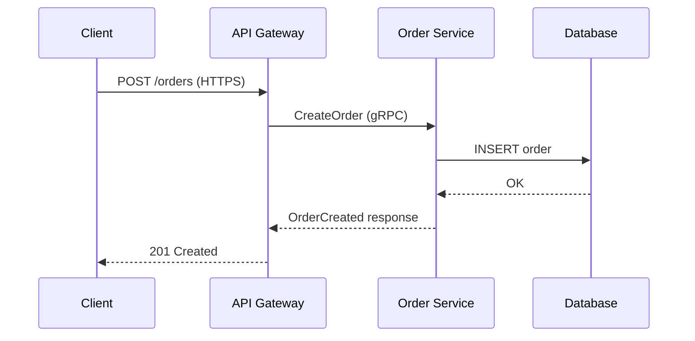

# နောက်ဆက်တွဲ G: Architecture Diagram Conventions နှင့် Symbols

---

## G.1 စာအုပ်တွင် သုံးသော Standard Symbols

### အခြေခံ Symbols

```
┌─────────────────┐
│   Rectangle     │  ── Service / Application component
└─────────────────┘

┌─────────────────┐
│   Rectangle     │  ── Database (မျဉ်းပိုထပ်)
│─────────────────│
└─────────────────┘

╔═════════════════╗
║   Bold border   ║  ── External system / Third-party
╚═════════════════╝

┌ ─ ─ ─ ─ ─ ─ ─ ┐
   Dashed border     ── Logical grouping / Namespace / VPC
└ ─ ─ ─ ─ ─ ─ ─ ┘

  ╱─────────────╲
 ╱   Cylinder    ╲  ── Database / Persistent storage
 ╲               ╱
  ╲─────────────╱

  ╭─────────────╮
  │   Cloud     │  ── Cloud service / External network
  ╰─────────────╯

  [   Queue   ]   ── Message queue / Event stream

  ◇                ── Decision point / Gateway

  ○────────────    ── API endpoint / Interface

  ⬡               ── Service mesh node
```

---

## G.2 မျဉ်းကြောင်း (Arrow) Conventions

| Arrow အမျိုးအစား | ASCII | အဓိပ္ပာယ် |
|-----------------|-------|---------|
| Synchronous request | `────→` | HTTP call, gRPC call, direct invoke |
| Asynchronous message | `- - →` | Kafka event, queue message |
| Response / reply | `←────` | Return value, response |
| Bidirectional | `←───→` | WebSocket, bidirectional streaming |
| Data replication | `══════→` | DB replication, sync |
| Dependency / reads from | `·····→` | Config read, passive dependency |
| Event publish | `──●──→` | Event published to broker |
| Event subscribe | `──○──→` | Service subscribes to event |

---

## G.3 Color Coding Conventions

> **မှတ်ချက်:** ဤစာအုပ်တွင် grayscale printing ပါတည်းတွင် pattern / shade ဖြင့် ကွဲပြားသည်။ Color PDF / digital version တွင် color ပြည့်ဝသည်။

| Component အမျိုးအစား | ရောင် (Color) | Pattern / Shade | ဥပမာ |
|---------------------|------------|---------------|------|
| **Client / Frontend** | ပြာ (Blue) | Light fill | Browser, Mobile App, CLI |
| **API Gateway / BFF** | မဲနီ (Teal) | Medium fill | Kong, AWS API Gateway, Nginx |
| **Microservice** | စိမ်း (Green) | Light fill | Order Service, User Service |
| **Database** | လိမ္မော် (Orange) | Cylinder shape | PostgreSQL, MySQL |
| **Cache** | ဝါ (Yellow) | Rounded rectangle | Redis, Memcached |
| **Message Queue / Broker** | ခရမ်း (Purple) | Queue shape | Kafka, RabbitMQ, SQS |
| **CDN / Static Storage** | ညိုပြာ (Indigo) | Cloud shape | CloudFront, S3, Cloudflare |
| **External Service** | မီးခိုး (Gray) | Bold border | Payment gateway, SMS provider |
| **Load Balancer** | ကြက်ဥရောင် (Amber) | Diamond / Triangle | Nginx, HAProxy, ALB |
| **Service Mesh / Sidecar** | နက် (Dark) | Hexagon | Envoy, Istio, Linkerd |

---

## G.4 Data Flow Diagram ဖတ်နည်း

### Data Flow ဖတ်ရှုမှုအဆင့်

```
Step 1: Initiator ရှာပါ
        ── Diagram ၏ ဘယ်ဘက် သို့မဟုတ် အပေါ်ဆုံးမှ စတင်သည်
        ── Client (Browser/Mobile) သည် များသောအားဖြင့် initiator

Step 2: Data flow ၏ direction ကို arrow ဖြင့် follow လုပ်ပါ
        ── Synchronous: solid arrow (────→)
        ── Asynchronous: dashed arrow (- - →)

Step 3: Labels ကို ဖတ်ပါ
        ── Arrow တွင် label ပါလျှင် — HTTP method, event name, data ကို ဖော်ပြ
        ── Number label (①②③) ပါလျှင် — sequence order ကို ဖော်ပြ

Step 4: Boundaries ကို စစ်ဆေးပါ
        ── Dashed box = service / VPC / namespace boundary
        ── Box အပြင် = external system

Step 5: Database interactions
        ── Arrow to database = write
        ── Arrow from database = read
        ── Double arrow = read + write
```

### ဖတ်နည်း ဥပမာ

```
         ①                ②                ③
Browser ────→ API Gateway ────→ Order Service ────→ [Orders DB]
             (HTTPS/443)      (gRPC/50051)        (PostgreSQL)
                                    │
                                    │ ④ event publish
                                    ▼
                              [Kafka: order.created]
                                    │
                              ⑤ subscribe
                            ╱──────────────╲
                     Email Service      Inventory Service
```

**ဖတ်နည်း:**
1. Browser မှ API Gateway သို့ HTTPS ဖြင့် request
2. API Gateway မှ Order Service သို့ gRPC ဖြင့် forward
3. Order Service မှ PostgreSQL သို့ order သိမ်းဆည်း (synchronous)
4. Order Service မှ Kafka သို့ `order.created` event publish (asynchronous)
5. Email Service နှင့် Inventory Service တို့ Kafka မှ subscribe ဖြင့် event ရ

---

## G.5 Common Pattern Templates

### Pattern 1: API Gateway + Services (Standard)

```
                    ┌ ─ ─ ─ ─ ─ ─ ─ ─ ─ ─ ─ ─ ─ ─ ─ ─ ─ ─ ─ ─ ─ ─ ─ ─ ─ ┐
                               Public Zone
                    │                                                       │
  ┌──────────┐         ┌─────────────────┐
  │ Browser  │──HTTPS─→│   API Gateway   │                                 │
  └──────────┘      │  │  (Kong / Nginx) │
                    │  └────────┬────────┘                                 │
  ┌──────────┐                  │ Route by path/header
  │  Mobile  │──HTTPS─→         │                                          │
  └──────────┘      │  ┌────────┴──────────────────────────────┐
                    │  │              Internal Network           │          │
                    │  │  ┌────────────┐  ┌────────────┐        │
                    │  │  │  User Svc  │  │ Order Svc  │        │          │
                    │  │  └─────┬──────┘  └─────┬──────┘        │
                    │  │        │                │               │          │
                    │  │   ╭────╯           ╭───╯               │
                    │  │   ▼                ▼                    │          │
                    │  │ [Users DB]    [Orders DB]               │
                    │  └────────────────────────────────────────┘          │
                    └ ─ ─ ─ ─ ─ ─ ─ ─ ─ ─ ─ ─ ─ ─ ─ ─ ─ ─ ─ ─ ─ ─ ─ ─ ─ ┘
```

### Pattern 2: Event-Driven Pipeline

```
  ┌────────────┐   event    ┌──────────────────────────────────────┐
  │  Producer  │──publish──→│                                      │
  │  Service   │            │     [Kafka / Event Broker]           │
  └────────────┘            │     Topic: domain.events             │
                            └──────────────────┬───────────────────┘
                                               │ subscribe
                    ┌──────────────────────────┼─────────────────────┐
                    │                          │                     │
                    ▼                          ▼                     ▼
           ┌─────────────┐           ┌─────────────┐       ┌─────────────┐
           │ Consumer A  │           │ Consumer B  │       │ Consumer C  │
           │ (Analytics) │           │ (Email Svc) │       │ (Audit Log) │
           └──────┬──────┘           └──────┬──────┘       └──────┬──────┘
                  │                         │                      │
                  ▼                         ▼                      ▼
           [Analytics DB]          [Email Provider]         [Audit Store]
           (ClickHouse)                                     (Elasticsearch)
```

### Pattern 3: CQRS Read/Write Split

```
            ┌─────────────────────────────────────────────────────────┐
            │                  CQRS Architecture                      │
            └─────────────────────────────────────────────────────────┘

  ┌──────────┐                                             ┌──────────┐
  │  Write   │   Commands                                  │  Read    │
  │  Client  │─────────→                                   │  Client  │
  └──────────┘          │                                  └──────────┘
                        ▼                                       ↑
               ┌─────────────────┐                             │ Queries
               │  Command Side   │                             │
               │  (Write Model)  │                    ┌────────────────┐
               └────────┬────────┘                    │   Query Side   │
                        │                             │  (Read Model)  │
                        │ Write                       └────────┬───────┘
                        ▼                                      │ Read
                 ┌─────────────┐   Sync via event    ┌────────▼───────┐
                 │  Write DB   │─ ─ ─ ─ ─ ─ ─ ─ ─ →  │   Read DB      │
                 │ (PostgreSQL)│  domain events       │  (Elasticsearch│
                 └─────────────┘                      │   / Redis)     │
                                                      └────────────────┘
```

### Pattern 4: Service Mesh (Sidecar Proxy)

```
  ┌ ─ ─ ─ ─ ─ ─ ─ ─ ─ ─ ─ ─ ─ ─ ─ ─ ─ ─ ─ ─ ─ ─ ─ ─ ─ ─ ─ ─ ─ ─ ─ ─ ─ ─ ┐
                           Kubernetes Cluster / Service Mesh

  │  ┌──────────────────────┐       ┌──────────────────────┐               │
     │  Pod A               │  mTLS │  Pod B               │
  │  │ ┌────────┐ ┌───────┐ │←─────→│ ┌───────┐ ┌────────┐ │               │
     │ │ App A  │ │Envoy  │ │       │ │Envoy  │ │ App B  │ │
  │  │ │(service│ │(sidecar│ │       │ │(sidecar│ │(service│ │               │
     │ │container│ │proxy) │ │       │ │proxy) │ │container│ │
  │  │ └────────┘ └───────┘ │       │ └───────┘ └────────┘ │               │
     └──────────────────────┘       └──────────────────────┘
  │                    ↑                    ↑                               │
                       │                    │  Telemetry + Config
  │                    └────────────────────┘                               │
                                  ↓
  │                    ┌─────────────────────┐                              │
                       │  Control Plane      │
  │                    │  (Istio / Linkerd)  │                              │
                       │  - Traffic routing  │
  │                    │  - mTLS certs       │                              │
                       │  - Observability    │
  │                    └─────────────────────┘                              │
   ─ ─ ─ ─ ─ ─ ─ ─ ─ ─ ─ ─ ─ ─ ─ ─ ─ ─ ─ ─ ─ ─ ─ ─ ─ ─ ─ ─ ─ ─ ─ ─ ─ ─ ─
```

---

## G.6 Diagram ရေးဆွဲသောအခါ Dos and Don'ts

### လုပ်သင့်သည်များ (Dos)

| လုပ်ရမည် | အကြောင်းပြချက် |
|---------|--------------|
| Consistent symbols တစ်မျိုးထဲ သုံးပါ | Reader confusion လျော့ပါ |
| Arrows တွင် protocol/method label ထည့်ပါ | Ambiguity ဖယ်ရှားပါ |
| Boundaries (VPC, namespace) ကို box ဖြင့် ဖော်ပြပါ | Deployment scope ရှင်းလင်းပါ |
| Sequence number (①②③) ထည့်ပါ | Data flow ဖတ်ရှုရ လွယ်ပါ |
| ကြည့်ရသူ audience ကို ဦးစားပေး simplify ပါ | Engineer မဟုတ်သောသူ ဖတ်ချင်လျှင် ပိုရိုးစင်ပါ |
| Legend / key ထည့်ပါ | Symbol meaning ရှင်းပါ |

### မလုပ်သင့်သည်များ (Don'ts)

| မလုပ်ရ | အကြောင်းပြချက် |
|--------|--------------|
| Database ကို service နှင့် တစ်ပုံစံထဲ မဆွဲပါ | Confusion ဖြစ်စေသည် |
| Too many arrows crossing | Spaghetti diagram ဖြစ်စေ reader ပင်ပန်းစေ |
| Internal implementation detail အားလုံး ထည့်ပါ | Diagram ကို system architecture level တွင် ထားပါ |
| Data format ကို arrows မှာ skip မလုပ်ပါ | JSON / Protobuf / Event schema ကို label ထည့်ပါ |
| Error paths ချန်မထားပါ | Happy path + failure path နှစ်ခုလုံး diagram ထဲ ပါမည် |

---

## G.7 Diagram Tools လမ်းညွှန်

| Tool | Category | အကောင်းဆုံးသုံးချိန် | Free? |
|------|---------|---------------------|-------|
| **draw.io** (diagrams.net) | GUI drag-drop | Team diagram, presentation | Yes |
| **Lucidchart** | GUI drag-drop | Collaborative, enterprise | Freemium |
| **Mermaid** | Code-as-diagram | Docs-as-code, markdown embed | Yes |
| **PlantUML** | Code-as-diagram | UML sequence diagrams | Yes |
| **C4 Model + Structurizr** | Architecture model | Layered architecture docs | Freemium |
| **Excalidraw** | Sketchy/hand-drawn style | Whiteboard, informal sharing | Yes |
| **Figma** | Design tool | Polished diagrams for presentations | Freemium |
| **ASCII art** (this book) | Text-based | Code comments, markdown | Yes |

### Mermaid ဥပမာ — Sequence Diagram

````markdown

````
